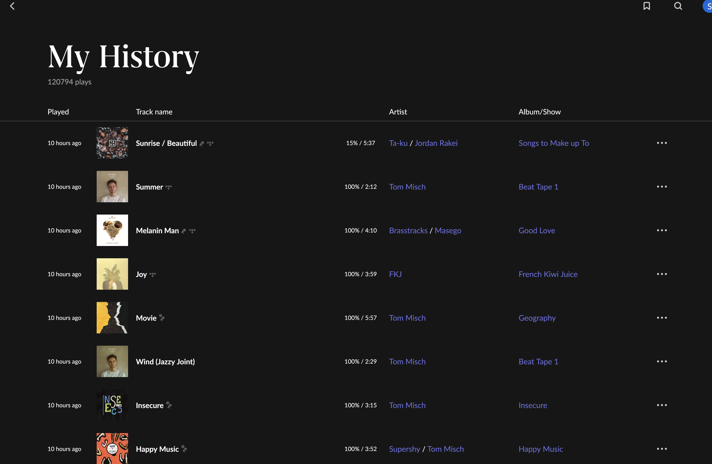

# roon-to-koito

Convert monthly Roon Excel exports into Koito-importable Spotify Extended Streaming History JSON.

Roon clearly has a real `My History` view, but that data is not exposed through Roon's public extension API in a way that is practical to export reliably.



Because of that, this tool takes monthly Excel exports and turns them into Koito import files instead of trying to scrape Roon's private internals. The Excel exports are made by creating a playlist of each month's play history manually in Roon and then exporting the playlist.

This is designed for workbook files named like `May 2021 Play History.xlsx`. The name comes from the playlist name I manually create/type.

## Usage

```sh
python3 roon2koito.py
```

Default behavior:

- read `.xlsx` files from `input/`
- write JSON files to `output/`

Or pass specific files:

```sh
python3 roon2koito.py "May 2021 Play History.xlsx"
```

Output goes to `output/Streaming_History_Audio_<year>_0.json`.

## Limitations

Since the playlist export isn't a true "play history" export, we're missing a played timestamp. My approach was to simply select a random time within that month. It's not perfect, but the best we can do until Roon exposes this information from the API natively.

Further, we're missing a semblance of "time played". The full Roon page includes % played, but that isn't included in the playlist export. As such, we just assume every item in the list was a full play.

## Notes

- No Python dependencies needed.
- If multiple monthly workbooks from same year exist, they are merged into one yearly JSON file.
- Rows missing `Title` or `Album Artist` from excel sheet are skipped.
- Timestamps are deterministic for stable reruns.
